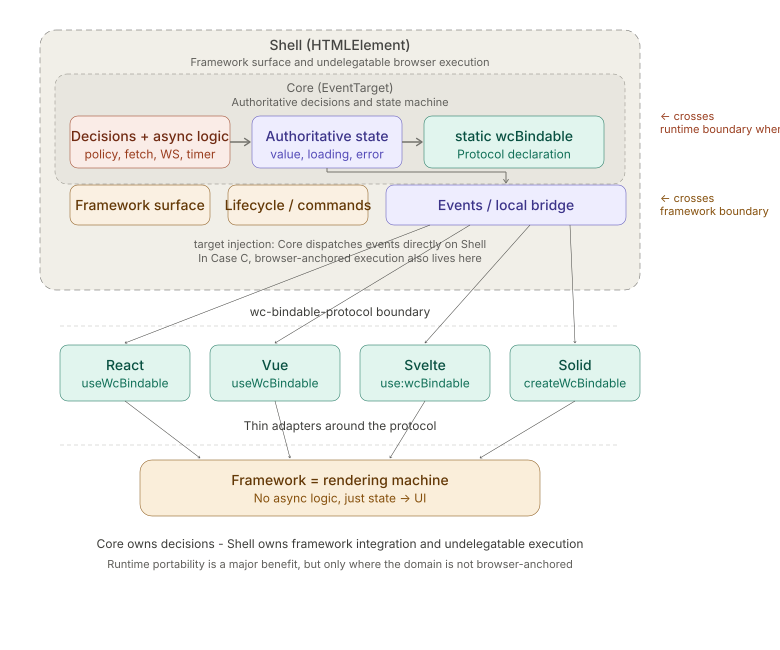

# Avoiding Frontend Framework Lock-in with CSBC and wc-bindable-protocol

> **Upstream tracked**: [wc-bindable-protocol](https://github.com/wc-bindable-protocol/wc-bindable-protocol) (protocol `version: 1`). This document's prose was last reconciled against the spec on **2026-05-18**.
>
> **Honest note on versions.** The reference implementations do not all pin the same `@wc-bindable/core` release. Declared ranges currently span `^0.4.0` (`feature-flags`, `stripe`), `^0.7.0` (`s3-uploader`), and `^0.8.0` (`ai-agent`, `ami-voice`, `auth0`); `lambda` and `webauthn` do not depend on it at all. This spread is disclosed here rather than hidden behind a single version number; converging it is tracked as P0-5 in [ROADMAP.md](./ROADMAP.md).

## Overview

CSBC (Core/Shell Bindable Component Architecture) is an architectural concept that splits a component into a headless **Core** that owns decisions and a **Shell** that handles framework integration and any execution the Core cannot delegate away, with state synchronization mediated by a minimal bindable protocol. Built on wc-bindable-protocol as its foundation, it enables reuse across any framework by keeping decisions in the Core regardless of whether the Core runs in the browser, on the server, or in another runtime.

This document summarizes the technical structure of CSBC, its contribution to solving the framework lock-in problem, and its practical operational benefits.

### Who this document is for

This document is aimed at engineering leads and architects evaluating CSBC for production use — typically SaaS teams, internal/enterprise platform teams, or library authors building reusable async components. It assumes a context where framework lifecycles, technology selection changes, or multi-framework coexistence are realistic concerns. For short-lived or single-framework hobby projects, the architecture is likely heavier than the problem warrants; readers in that situation can use this document to confirm that explicitly rather than guess.

## Scope and Non-Goals

CSBC is deliberately narrow. To prevent it from being stretched into roles it was not designed for, the following are explicit non-goals at the architecture level (in addition to the protocol-level scope limitations listed later):

- **Application-wide state management.** CSBC encapsulates per-domain async services (a fetch, a feature-flag stream, an upload session). It does not replace a global store such as Zustand, Pinia, Redux, or Vuex. Cross-component application state should still live in a dedicated layer.
- **SSR / hydration integration.** CSBC components are designed to run in the browser (or, for the Core, in a non-DOM runtime). They are not a vehicle for server-rendered HTML or hydration matching.
- **UI component libraries.** CSBC components are headless on purpose. They do not ship visuals, theming, or accessibility primitives. A separate UI layer (framework components, design system, or `data-wcs` adapters) is always required.
- **Build-tool and bundler integration.** CSBC takes no position on bundlers, monorepo tooling, or framework-specific build pipelines. Each consuming project owns those decisions.
- **Form input two-way binding.** Inherited from the protocol's scope limitations; CSBC does not introduce an implicit two-way sync layer on top.

If a team needs any of the above, those needs should be met by other mechanisms — not by widening CSBC.

## Background: The Nature of Framework Lock-in

Framework lock-in in frontend development is often framed as a UI component compatibility problem. However, the true source of migration cost lies in business logic — specifically, asynchronous processing.

`fetch` calls, WebSocket connections, polling, loading state management — these are all written tightly coupled to framework-specific lifecycle APIs: React's `useEffect`, Vue's `onMounted`, Svelte's `onMount`, and so on. When migrating frameworks, rewriting templates can be done mechanically, but re-implementing async logic requires semantic understanding of the code. This is where the real bottleneck lies.

The assumption that framework migration is a real concern is itself worth stating. In practice, lock-in becomes a concrete cost in three recurring situations: (a) a major framework reaches end-of-life or undergoes a discontinuous version jump (Angular 1 → 2, Vue 2 → 3); (b) organizational events — mergers, acquisitions, platform consolidations — force two stacks to coexist or converge; (c) a deliberate technology re-selection driven by hiring, performance, or strategic alignment. CSBC is most valuable for teams that consider any of these scenarios likely on a 5–10 year horizon. Teams for whom none of them apply should weigh the trade-offs in the next section before adopting it.

## Quality Attribute Priorities

CSBC is the result of optimizing for a specific ordering of quality attributes. A different ordering would justify a different architecture. The ordering CSBC commits to is:

**Evolvability (framework substitutability) > Operational portability > Performance > Initial implementation cost**

Reading the ordering:

1. **Evolvability** — the ability to swap, mix, or migrate frameworks without rewriting business logic is the dominant goal. Every other property is allowed to give way for this.
2. **Operational portability** — the ability to run the same Core in the browser, in Node/Deno/Workers, or behind a remote proxy is the second priority: important, but subordinate to evolvability. It comes after evolvability because some domains are browser-anchored (Case A, Case C) and cannot achieve it; CSBC still applies in those cases.
3. **Performance** — latency and throughput matter, but extra indirection layers and remote round trips are accepted when they buy evolvability.
4. **Initial implementation cost** — the Core/Shell split and the protocol discipline cost more on day one than writing a framework-native component. CSBC explicitly pays this cost to gain the three above.

### Trade-offs Made Explicit

| Gained | Given up | Where it shows up |
|--------|----------|-------------------|
| Framework substitutability | Extra indirection: Core → Shell → adapter → framework | Slight per-event dispatch overhead; more files per feature than a framework-native component |
| Clean Core/Shell separation | Higher authoring and learning cost than a plain Web Component | Two-class discipline; reviewers must judge which side owns which code |
| Remote Core (Case B) | WebSocket round trip on initial state | Higher first-paint / first-interaction latency than an in-browser Core |
| Server-resident Core (Cases B and C) | Cannot ship as a purely static site; persistent-connection-aware ops required | Hosting cost, reconnection strategy, sticky-session or session-affinity design |
| Headless design (no Shadow DOM) | Cannot be consumed as a UI component | A separate UI layer is always required (acknowledged in "The Headless Insight") |
| Conformance to a normative protocol | Cost of tracking upstream spec changes | Periodic upstream sync work (the v0.7.1 sync recorded at the top of this document is an instance) |

### When CSBC Is the Wrong Choice

If the priority ordering above does not match the project's reality, CSBC should not be adopted. Concretely:

- **Sub-millisecond latency is the top priority** (e.g., trading or media UIs): Case B's WebSocket-mediated initial state is unacceptable; Case A may still apply, but the indirection cost should be measured first.
- **The team has firmly committed to a single framework for the application's expected lifetime** and the application is small enough that framework migration is not a credible scenario: native framework code is a more honest match for the actual priorities.
- **The deployment target cannot host a long-lived server** (pure static hosting only): Cases B and C are off the table; only Case A is available, which removes a large fraction of CSBC's value.

These rejection conditions exist so that adopting CSBC remains a deliberate decision rather than a default.

### Re-evaluation Triggers

The priority ordering and the architecture that follows from it rest on a set of stable platform assumptions. If any of the following changes materially, the architecture should be re-examined rather than patched in place:

- **`EventTarget` / `CustomEvent` ceases to be a stable, universal primitive** across browser and server runtimes — the protocol's zero-dependency story would no longer hold.
- **Long-lived WebSocket (or equivalent FIFO) transport becomes operationally infeasible** in the dominant deployment targets — Cases B and C would lose their default transport, forcing either a new default or a scope retraction to Case A.
- **A protocol-level breaking change is forced** that cannot be expressed as a new `protocol` identifier under the existing `version: 1` discipline — the long-lived-version assumption itself would be at risk.
- **Framework lock-in ceases to be a meaningful cost** — for example, if a single framework consolidates the ecosystem for the long term, or a standard cross-framework component model subsumes the protocol — the top priority of evolvability would no longer justify the Core/Shell split.
- **A framework-neutral async-state boundary becomes mainstream.** Data-fetching and state libraries (TanStack Query, Zustand, Jotai, Nanostores, etc.) currently bind through framework-specific hooks. If they begin exposing their state machines over `EventTarget` or a standardized reactive primitive instead, the specific gap CSBC fills — a portable, framework-neutral Core boundary — narrows, and the Core/Shell authoring cost may stop paying for itself.
- **A reactive-value primitive is standardized** (e.g. the TC39/W3C Signals effort). A standard, framework-neutral representation of reactive state would deliver much of the "subscribe to a state machine" benefit without a bespoke `wcBindable` declaration, weakening the case for the protocol layer specifically.
- **Server-driven async displaces client-owned async.** If React Server Components, Server Functions, or equivalents push the bulk of fetch/orchestration back across the network by default, the volume of browser-resident async logic that CSBC externalizes shrinks — reducing the size of the problem rather than the quality of the solution.
- **No independent (non-author) implementation or adopter materializes over a long horizon.** Because part of the evolvability bet is durability, a sustained absence of any second-party implementation is itself a signal that the bet is not being validated in practice (see the single-author limitation noted under [Virtually Eliminated OSS Dependency Risk](#virtually-eliminated-oss-dependency-risk)).

Naming these triggers makes the architecture's expiration conditions explicit rather than leaving them implicit in the priority ordering above.

## CSBC's Architecture

CSBC structurally resolves this problem by moving the location of async processing from the framework side into the Web Component side.

### Three-Layer Structure

CSBC's architecture consists of three layers:

**Headless Web Component Layer** — Encapsulates async processing (HTTP communication, WebSockets, timers, etc.) internally and autonomously manages state (`value`, `loading`, `error`, `status`, etc.). It has no UI whatsoever and functions as a pure service layer. The label refers to the service-facing component boundary; internally this layer is typically split into an `EventTarget` Core and an `HTMLElement` Shell (see [Core/Shell Separation](#coreshell-separation)), so not every class in this layer is itself a Web Component.

**Protocol Layer (wc-bindable-protocol)** — Components declare their bindable properties via a `static wcBindable` field and notify state changes via `CustomEvent`. Adapters simply read this declaration and subscribe to the events.

**Framework Layer** — Connects to the protocol through a thin adapter and renders the received state. It does not own domain async orchestration such as fetch lifecycles, retry, polling, authorization-sensitive transitions, or loading/error state machines; framework-native concerns (UI event handlers, dynamic imports, animations, route transitions, analytics) remain wherever the framework normally puts them.



The diagram above shows the **base CSBC shape**: the Core owns the authoritative state machine and decisions, while the Shell is the framework-facing surface that receives events and exposes the protocol boundary to adapters. In the thin-Shell cases, the Shell adds little beyond lifecycle, command forwarding, and local event bridging. In **Case C**, the same structure still holds, but the Shell additionally carries browser-anchored execution that cannot be delegated to the Core's runtime.

### Core/Shell Separation

The Headless Web Component Layer can be further decomposed into two distinct parts: a **Core** and a **Shell**. The most useful invariant is not "the Shell is always thin" but rather:

**Core owns decisions** — business logic, policy, state transitions, authorization-sensitive behavior, and event emission.

**Shell owns only undelegatable execution** — framework binding, DOM lifecycle, and any browser-anchored execution the Core cannot perform from its own runtime.

From that invariant, two common consequences follow.

**Core (EventTarget)** — The Core contains the authoritative logic and state machine. It extends `EventTarget`, not `HTMLElement`, so when the domain allows it, it has zero DOM dependency and can cross the **runtime boundary** into Node.js, Deno, Cloudflare Workers, and other runtimes. That portability is a major benefit, but it is not the primary invariant: some domains are browser-anchored and therefore keep the Core in the browser.

**Shell (HTMLElement)** — The Shell is the framework-facing surface. It extends `HTMLElement`, so frameworks can reference it via `ref` and adapters can bind to it. In the simplest case it is a thin wrapper that maps attributes and lifecycle to the Core. In other cases it may be a command proxy or a browser-side execution engine. The Shell crosses the **framework boundary**.

```
┌─────────────────────────────────────────────────┐
│  Core (EventTarget)                             │
│  - owns decisions, state, dispatchEvent         │
│  - often runtime-portable when domain allows    │
├─────────────────────────────────────────────────┤
│  Shell (HTMLElement)                            │
│  - framework surface, lifecycle, execution      │
│  - enables framework binding via ref            │
└─────────────────────────────────────────────────┘
```

The key design pattern enabling this separation is **target injection**: the Core's constructor accepts an optional `target` parameter (an `EventTarget`) to which it dispatches all events. When omitted, it defaults to `this` — the Core itself. When the Shell passes `this` (the `HTMLElement`) as the target, Core events fire directly on the DOM element, requiring no event re-dispatch.

```javascript
// Core — pure EventTarget, no DOM
class MyFetchCore extends EventTarget {
  static wcBindable = { /* ... */ };
  #target;

  constructor(target) {
    super();
    this.#target = target ?? this;
  }

  // Events dispatch on #target
  #setLoading(loading) {
    this.#target.dispatchEvent(
      new CustomEvent("my-fetch:loading-changed", { detail: loading, bubbles: true }),
    );
  }

  async fetch(url, options = {}) { /* ... */ }
}
```

```javascript
// Shell — thin HTMLElement wrapper
class MyFetch extends HTMLElement {
  static wcBindable = MyFetchCore.wcBindable;
  #core;

  constructor() {
    super();
    this.#core = new MyFetchCore(this); // events fire directly on this element
  }

  // Attribute mapping (DOM-specific)
  get url() { return this.getAttribute("url") || ""; }

  // Delegate to core
  async fetch() { return this.#core.fetch(this.url, { method: this.method }); }

  // Lifecycle (DOM-specific)
  connectedCallback() { if (!this.manual && this.url) this.fetch(); }
  disconnectedCallback() { this.#core.abort(); }
}
```

This separation yields three practical benefits:

1. **Framework decoupling** — The UI layer binds to state and commands instead of owning async orchestration.
2. **Execution confinement** — Security-sensitive or platform-anchored work stays on the side that must own it.
3. **Runtime portability when available** — When the domain is not browser-anchored, the Core can be unit-tested and reused outside the browser.

### Three Canonical Cases

The thin-Shell case is important, but it is not the only canonical shape. In practice CSBC appears in three parallel cases.

| Case | Shape | Typical example | What the Shell does |
|------|-------|-----------------|---------------------|
| A | Core in browser | `auth0-gate` local | Thin framework-facing wrapper around a browser-anchored Core |
| B | Core on server + thin Shell | `ai-agent` remote, `feature-flags` | Proxy, command delegation, or observation adapter over the wire |
| C | Core on server + browser-anchored execution Shell | `s3-uploader`, `passkey-auth`, `stripe-checkout` | Executes the data plane the browser platform refuses to delegate |

> **Operational prerequisites for Cases B and C.** Both cases assume a server runtime capable of holding long-lived connections (Node, Deno, Bun, or equivalent), a client-side reconnection strategy, and a scaling model that accounts for stateful sessions (sticky routing, session migration, or per-connection state replication). Case A runs entirely in the browser; Cases B and C cannot be deployed as a purely static site. The choice between A and B/C is therefore not only an architectural decision but also an operational commitment, paid for in infrastructure and on-call surface. This trade-off is captured in the priority ordering under [Quality Attribute Priorities](#quality-attribute-priorities) — operational portability is intentionally ranked below evolvability.

Case C is not a deviation from CSBC. It is a first-class case for domains where the browser owns an execution surface the server cannot stand in for: direct object upload, WebRTC, WebUSB, WebBluetooth, `File System Access API`, clipboard / drag-and-drop / paste flows, camera / microphone capture, and other user-gesture- or device-anchored capabilities.

### Case C: Browser-Anchored Execution

The familiar thin-Shell rule holds whenever the Core can reach every external system the work requires — HTTP fetches, DB writes, cron, and so on — from its own runtime.

There is a different but equally canonical class of work where it cannot. When the **data plane** must run in the browser for reasons unrelated to business logic — direct upload to object storage, WebRTC, WebUSB, the `File System Access API`, anything gated on a user gesture or that would otherwise tunnel a payload through the WebSocket — the Shell stops being a thin marshaller and becomes the **data-plane executor**. The Core retains the **control plane** (signing, authorization, post-processing, persistence) and the wire still carries only small JSON-RPC messages, but the Shell now holds an XHR pump, a worker pool, retry / re-sign logic, and abort plumbing.

`@wc-bindable/s3` is the canonical example: the bytes go browser → S3 directly because tunneling them through the control WebSocket would (a) double the egress cost, (b) waste the server's bandwidth, and (c) defeat S3's parallel multipart upload. The Shell ends up substantial: the `s3-uploader` Shell is ~1,170 lines (its Core ~1,300) — comparable to, not a fraction of, the Core. "Thin Shell" is a property of the thin-Shell cases, not of Case C; here the Shell carries a real execution engine. That size is not a violation of CSBC's intent. It is the correct CSBC shape when the data plane is anchored to the browser by the platform.

`@wc-bindable/stripe` is the same shape driven by a different constraint: PCI scope. Card data must never touch application code, so Stripe Elements renders the input inside a Stripe-owned iframe and POSTs the PAN directly from browser → Stripe. The Core (server) holds the secret key, builds PaymentIntents / SetupIntents, and verifies webhooks; the Shell loads Stripe.js, mounts the Payment Element, drives `confirmPayment` / `confirmSetup`, and handles the 3DS redirect return. The wire between them carries only intent identifiers, confirmation outcomes, and webhook-driven status — never card data. A Shell that tried to read the card number itself would not just be a CSBC violation; it would pull the entire application into PCI scope.

The principle that survives across all three cases is:
**the Core owns every *authority* decision; the Shell owns only execution it cannot delegate — including the local decisions that execution inherently carries.** The line is about *authority*, not about whether the Shell decides anything at all. A "thick" Shell that signs its own URLs, sets its own authorization policy, or decides what the user is allowed to do would be a CSBC violation, regardless of byte count. A thick Shell that PUTs bytes to a Core-signed URL is not — and neither is one that makes the *execution-local* decisions that pumping those bytes requires.

Be honest about that gray zone, because the flagship Case C Shells live in it. The `s3-uploader` Shell chooses its own PUT retry policy, interprets a 403 as "expired signature → re-sign and retry" versus "genuine denial," and decides when a part URL's remaining TTL is low enough to eagerly re-sign before use. The `stripe` Shell decides which of a racing remote and local error is authoritative. None of these is an *authority* decision — the Core still issues the signatures, owns the authorization, and drives the intent — so none is a violation. The rule is therefore not "the Core makes every decision"; it is "the Core owns every decision about authority, identity, and policy, and the Shell may own the local decisions inherent to executing what the Core authorized."

When you build a CSBC component and the Shell starts to grow, ask which side of *that* line the new code is on. Authority, identity, policy, signing → Core. Pumping bytes that cannot leave the browser, and the execution-local decisions that pumping requires → Shell.

**Recovery contract for browser-anchored data planes.** Because the Shell holds executor state the Core cannot reconstruct on its own, the two sides split recovery responsibilities — but the two halves of that split do not have the same status, and it is important not to overstate the stronger one.

*Abortability* is a **required invariant** of every Case C component. The **Shell** must make every in-flight unit of work (an XHR, a worker job, a 3DS redirect) respond to a `dispose()` or `abort()` signal and clean up its own resources without leaving partial state on the platform side. Both `s3-uploader` and `stripe` implement this.

*Resumability* is a **domain-dependent option, not a cross-Case C invariant.** Where the control plane can cheaply own a checkpoint, the **Core** persists it and a new Shell session resumes rather than restarts — `stripe` does exactly this: `StripeCore.resumeIntent` rebuilds the active intent from the intent ID and awaited status, with idempotency and an optional resume authorizer. But `s3-uploader` is **explicitly not resumable**: when the WebSocket drops mid-multipart the upload is aborted, and resumable mode is deliberately kept out of the core package (roadmapped to a separate `@csbc-dev/s3-uploader-resumable`). So how far recovery goes beyond abortability is a **per-component design choice**, decided by whether that component's data-plane checkpoint (upload ID + completed parts, intent ID + awaited status, …) is cheap for the Core to own — not a guarantee CSBC makes for every adopter. Signed-URL expiry, partial PUT failures, and control-channel disconnects are still treated as expected events in either design; what differs is whether the component resumes from the last checkpoint or restarts.

### A More Accurate Taxonomy

The A/B/C split is useful, but real packages show that Case B itself has two sub-shapes:

- **B1: command-mediating thin Shell** — The browser surface forwards inputs and commands to a remote Core while exposing the same bindable state locally. `ai-agent` fits here.
- **B2: observation-only thin Shell** — The browser surface exists mainly to subscribe to a remote session proxy and re-dispatch a shape that works with `data-wcs`. `feature-flags` fits here.

That makes a small matrix more accurate than a single numbered ladder:

| Core location | Shell role | Example |
|---------------|------------|---------|
| Browser | Thin wrapper around browser-anchored Core | `auth0-gate` local |
| Server | Command-mediating / proxy thin Shell | `ai-agent` remote |
| Server | Observation adapter thin Shell | `feature-flags` |
| Server | Browser-anchored execution Shell | `s3-uploader`, `passkey-auth`, `stripe-checkout` |

This framing keeps the true invariant in view. Runtime portability remains a major advantage, but it is a consequence available to some domains, not the sole definition of CSBC.

### Core Composition and Granularity

**Granularity guideline.** One Core corresponds to one addressable async resource: a single fetch endpoint, one feature-flag stream, one upload session, one auth session. Cores are not page-sized and not call-sized — they are the unit at which a domain owns its async behavior.

**Composition.** Cores are plain `EventTarget`s, so composition between them uses the same primitive their UI consumers do. Three patterns are normative:

- **Observation** — one Core listens to another Core's events directly via `addEventListener`, or via `bind()` if the dependency declares `wcBindable`. This is the default; it preserves the source Core's authority over its own state.
- **Shell-mediated injection** — a Shell that hosts multiple related Cores wires them together at construction time (for example, an upload Shell that takes an `auth` Core in its constructor and reads the current token). The Shell owns the lifetime of the composition.
- **Command invocation** — when one Core needs to ask another Core to *do* something (not just observe state), it calls a declared command. This is the rarest pattern; observation is preferred whenever the dependency can be expressed as state.

A Core must never reach for another Core through globals or service locators. Composition is always declared at the construction site so the dependency graph stays auditable — and so a Core's set of dependencies can be reasoned about without scanning runtime behavior.

### Remote: Core/Shell Separation Over the Network

The Core/Shell separation naturally extends to a network boundary. With `@wc-bindable/remote`, the Core runs on a server while the client holds a proxy `EventTarget` — and `bind()` works identically on both sides.

```
Client (Browser)                        Server (Node / Deno / etc.)
┌──────────────────────┐  WebSocket   ┌──────────────────────┐
│  RemoteCoreProxy     │◄────────────►│  RemoteShellProxy    │
│  (EventTarget)       │              │                      │
│                      │              │  Core (EventTarget)  │
│  bind() just works   │              │  Business logic here │
└──────────────────────┘              └──────────────────────┘
```

`RemoteShellProxy` subscribes to the Core's declared events, applies per-property getters on the server side, and forwards property-centric `update` messages over the wire. `RemoteCoreProxy` maintains a local cache, dispatches synthetic events, and exposes a small invocation surface for inputs and commands:

- `set(name, value)` — fire-and-forget, at-most-once
- `setWithAck(name, value)` / `setWithAckOptions(name, value, options?)` — acknowledged assignment returning a `Promise<void>`, with optional `timeoutMs` and `AbortSignal`
- `invoke(name, ...args)` / `invokeWithOptions(name, args, options?)` — call a declared command and receive its serialized return value
- `dispose()` — idempotent teardown; subsequent calls reject with `WC_BINDABLE_DISPOSED`
- `reconnect(transport)` — attach a fresh transport after the previous one closed

Failures reject with a normative `WC_BINDABLE_*` error code registry — `WC_BINDABLE_TIMEOUT`, `WC_BINDABLE_ABORTED`, `WC_BINDABLE_REMOTE_THROW`, `WC_BINDABLE_TERMINAL_FAILURE`, `WC_BINDABLE_PROTOCOL_ERROR`, and so on — so callers can branch on transport-vs-application failures without parsing messages. The wire format is property-centric JSON only (no `NaN` / `Infinity` / cycles / symbols), validated deeply on both ends before serialization, with FIFO ordering and a default 1 MiB per-envelope cap. Because the proxy is a standard `EventTarget`, every framework adapter works without modification.

This means the three boundaries that CSBC crosses — runtime, framework, and now network — are all handled transparently by the same protocol:

| Boundary | Crossed by | Mechanism |
|----------|-----------|-----------|
| Runtime | Core (EventTarget) | No DOM dependency; works in Node, Deno, Workers |
| Framework | Shell (HTMLElement) | Attribute mapping + `ref` binding |
| Network | Remote (WebSocket / custom transport) | Proxy EventTarget + JSON wire protocol |

The transport layer is pluggable — WebSocket is the default, but any FIFO channel (MessagePort, BroadcastChannel, WebTransport, etc.) can be used by implementing the minimal `ClientTransport` / `ServerTransport` interfaces.

#### Fan-out Model

The default deployment model is **one Core instance per consumer connection**: a new transport session instantiates its own Core and tears it down on disconnect, so per-session state isolation is the baseline. **Shared Cores** — a single server-side Core observed by multiple clients (real-time dashboards, collaborative editing, multi-tab parity) — are an explicit opt-in. In that mode the Shell-side proxy fans state out to every subscriber, and the application owns authorization, per-subscriber filtering, and any conflict-resolution semantics. This split keeps the simple case stateless-per-session and concentrates the hard problems in the opt-in path, rather than imposing fan-out machinery on every adopter.

#### Disconnection Semantics

When the transport drops, the proxy behaves predictably so UIs can render a meaningful degraded state instead of guessing:

- **In-flight `setWithAck` and `invoke` calls** reject with `WC_BINDABLE_TERMINAL_FAILURE` (or with `WC_BINDABLE_TIMEOUT` if the configured timeout expires first, or `WC_BINDABLE_PROTOCOL_ERROR` on a protocol violation).
- **Fire-and-forget `set` calls** issued while disconnected are dropped; the protocol gives no at-least-once guarantee for them.
- **The local state cache is retained.** It is not invalidated automatically, so the UI can keep rendering the last-known values; whether to mark them as stale is the application's decision.
- **`loading` and other bindable values do not change on disconnect.** They reflect the Core's state machine, not the transport's. Applications that need to display connection status should subscribe to a separate transport-level signal rather than overload `values.loading`.
- **`reconnect(transport)` resumes the proxy** with a fresh transport; the Core resubscribes the consumer and re-emits initial values, so the local cache converges to the authoritative state.

This contract surfaces transport failures as application-visible signals rather than hiding them behind transparent retries. Application code that needs at-least-once or retry semantics composes them on top of these primitives explicitly.

#### Authentication and Authorization

Peer authentication, per-input authorization, and rate limiting are explicitly out of CSBC's scope and must be provided by the deployment layer (see SPEC-extensions §Trust Boundary). The protocol carries no identity tokens of its own; the transport's handshake or an application-level envelope is responsible. CSBC therefore does not protect a server-side Core from a misbehaving client on its own — that is the deployment's job.

### Conversion to a State Machine Subscription

The core insight of this architecture is that async processing is converted into a subscription to a state machine. From the framework's perspective, properties like `values.loading` and `values.error` exposed by a component such as `<my-fetch>` are simply reactive values — there is no need to be aware that async processing is happening at all. Whether written in React or Vue, the code structure becomes nearly identical.

```tsx
// React — no fetch(), no async/await, no loading state management needed
const [ref, values] = useWcBindable<MyFetchElement, MyFetchValues>();
// values.loading, values.value, values.error — all reactive
```

```vue
<!-- Vue — same component, same structure -->
<script setup>
const { ref, values } = useWcBindable({ value: null, loading: false });
</script>
<template>
  <my-fetch :ref="ref" url="/api/data" />
  <p v-if="values.loading">Loading...</p>
  <p v-else>{{ values.value }}</p>
</template>
```

## Design of wc-bindable-protocol

### Minimal Convention

The protocol declaration is extremely small:

```javascript
class MyFetch extends HTMLElement {
  static wcBindable = {
    protocol: "wc-bindable",
    version: 1,
    properties: [
      { name: "value",   event: "my-fetch:value-changed" },
      { name: "loading", event: "my-fetch:loading-changed" },
      { name: "error",   event: "my-fetch:error-changed" },
      { name: "status",  event: "my-fetch:status-changed" },
    ],
    inputs: [
      { name: "url", attribute: "url" },
      { name: "method", attribute: "method" },
    ],
    commands: [
      { name: "fetch", async: true },
      { name: "abort" },
    ],
  };
}
```

Each property descriptor requires only two fields: `name` (property name) and `event` (CustomEvent name). An optional `getter` function can customize how the event payload is extracted. Optionally, `inputs` and `commands` can declare the component's input interface — settable properties and callable methods. These declarations are purely descriptive and do not create automatic two-way synchronization; they exist to enable tooling, documentation generation, and remote proxying of components. Within each list (`properties` / `inputs` / `commands`), every `name` must be unique; otherwise the declaration is invalid and discovery returns `undefined`.

The `version: 1` literal is intended to be **long-lived**. The protocol's policy is that any breaking change is signaled by minting a new `protocol` identifier rather than bumping `version`, so conformant observers accept `version >= 1` and components remain forward-compatible across additive evolution of the spec.

The same additive-only discipline applies to **individual component declarations**. Adding a new entry to `properties`, `inputs`, or `commands` is a compatible change for consumers, but renaming or removing a declared `name`, changing an `event` string, or making an existing `input` required are breaking changes that require coordinated migration. Treat a component's `wcBindable` declaration as a public API surface and evolve it under the same compatibility rules as a published library.

### Zero Dependencies — Web Standards Only

The protocol uses only standard APIs: `static` class fields, `EventTarget`, and `CustomEvent`. No build tools, no polyfills, no runtime libraries. All three are stable, long-standing Web standards available across browsers and server-side runtimes (Node.js, Deno, Cloudflare Workers). A future in which `EventTarget` or `CustomEvent` is deprecated is difficult to imagine. This characteristic provides a strong answer to the question: "Will this still work in 10 years?"

### Deliberate Scope Limitations

The protocol intentionally excludes the following from its scope:

- Automatic two-way synchronization (the protocol can declare both outputs and inputs, but synchronization is always explicit — never implicit)
- Form integration
- SSR / hydration
- **Application-level validation and domain schema enforcement.** CSBC does not validate business payloads, form values, authorization policies, or domain-specific command arguments. The protocol does validate its own declaration and wire shapes (`version >= 1`, malformed descriptors rejected at discovery, JSON-only wire format with a 1 MiB envelope cap, etc.) — what is excluded is application-level validation of the data those shapes carry.

The moment the scope is expanded, complexity explodes. These limitations reflect sound design judgment.

## The Thinness of the Adapter

The core `bind()` function can be implemented in roughly 30 lines. The spec requires the returned cleanup function (`UnbindFn`) to be **idempotent** and **exception-safe**, and initial sync to use the `in` operator so an explicitly assigned `undefined` is honored rather than skipped:

```javascript
const DEFAULT_GETTER = (e) => e.detail;

function bind(target, onUpdate, options = {}) {
  const decl = target.constructor.wcBindable;
  if (decl?.protocol !== "wc-bindable" || !(decl.version >= 1)) return () => {};

  const teardowns = [];
  let disposed = false;

  try {
    for (const prop of decl.properties) {
      const getter = prop.getter ?? DEFAULT_GETTER;
      const listener = (event) => onUpdate(prop.name, getter(event));
      target.addEventListener(prop.event, listener);
      teardowns.push(() => target.removeEventListener(prop.event, listener));

      // Initial sync — `in` distinguishes "explicit undefined" from "missing"
      if (options.syncOn !== "connect" && prop.name in target) {
        onUpdate(prop.name, target[prop.name]);
      }
    }
  } catch (err) {
    teardowns.forEach((fn) => fn()); // exception-safe: tear down before rethrow
    throw err;
  }

  return () => {
    if (disposed) return;            // idempotent
    disposed = true;
    teardowns.forEach((fn) => fn());
  };
}
```

Note that `bind()` accepts any `EventTarget` — it works with both the Shell (`HTMLElement`) via framework adapters and the Core (`EventTarget`) directly. The `syncOn: "connect"` option defers initial reads until DOM connection, useful for elements bound before they enter the document.

The spec defines three conformance levels — **Level 1** (protocol: producer 1P / observer 1O), **Level 2** (core JS API with the normatively-named exports `getWcBindableDeclaration` / `isWcBindable` / `bind`), and **Level 3** (remote wire format from SPEC-extensions.md). Adapters typically target Level 2.

Framework-specific adapters are also just a few dozen lines each. React's `useWcBindable`, Vue's `useWcBindable`, and Svelte's `use:wcBindable` are all thin wrappers around this core function.

**What is exercised, and what is asserted.** To be honest about the "works with any framework" claim: the React and Vue adapters are backed by runnable example apps in *every* reference package (each ships `react/` and `vue/` example directories, alongside framework-neutral `vanilla` and `@wcstack/state` variants). The Svelte and Solid adapters follow from the same ~30-line `bind()` and appear in snippets, but they are **not yet exercised by a runnable example app** in this repository set. So the cross-framework claim is *proven* for React and Vue and *argued from adapter thinness* for the rest — a distinction worth keeping explicit until a Svelte/Solid example lands.

## Effectiveness as a Framework Lock-in Escape

### Commoditization of Frameworks

Once async processing is externalized into Web Components, the framework layer becomes a pure rendering machine. As a result, the criteria for choosing a framework shift. Rather than evaluating how well a framework handles business logic or async processing, teams can choose based on superficial factors: template syntax preference, rendering performance, developer experience. This is the commoditization of frameworks.

### Freedom from "Irreversible Decisions"

Framework selection has traditionally been a weighty, long-term decision. With CSBC, migrating frameworks means rewriting only templates and bindings — the business logic layer remains intact. Framework selection becomes a choice that can be revisited at any time, dramatically reducing the organizational cost of decision-making.

### Retaining the Benefits of Frameworks

Most framework lock-in escape strategies ultimately reduce to either "don't use a framework" or "add another abstraction layer," each of which creates its own new form of lock-in. CSBC takes the opposite approach: it assumes continued framework use and simply externalizes only the non-portable parts. Declarative UI, reactive rendering, and framework-specific ecosystems can all be enjoyed as-is.

## Practical Operational Benefits

### Incremental Adoption

There is no need for a full upfront migration of existing applications. Teams can start by writing only new API calls as headless Web Components and gradually move async processing outside the framework. Thanks to the spec's initial value sync behavior, calling `bind()` partway through correctly picks up existing state, so coexistence with legacy code is not a problem.

### Migration Playbook

In practice, incremental adoption works best as **strangle by domain, not by file**. Existing `useEffect` or `onMounted` calls are not rewritten on a schedule. New domain services are written as CSBC components, and old async logic is migrated opportunistically — when its host feature is already being touched for another reason. This keeps the migration off the critical path of any single quarter and avoids the common failure mode of a "CSBC migration project" that has to compete for capacity against feature work and quietly loses.

### Observability

Every Core state transition is a `CustomEvent`. That makes the observability question largely one of *where* to hook in rather than *whether* it is possible:

- **State-transition metrics.** Adapters can emit metrics from the same listener that updates the framework, so one listener covers UI rendering and observability simultaneously without separate instrumentation.
- **Distributed tracing.** Cases B and C cross a process boundary, so wire envelopes are expected to carry W3C `traceparent` (or an application-equivalent context) on the transport's metadata channel, so server-side spans can be correlated with the originating browser action. The protocol itself does not mandate the field; the deployment is expected to add it.
- **Error attribution.** The normative `WC_BINDABLE_*` error registry doubles as a stable key set for log aggregation and alerting. `WC_BINDABLE_TERMINAL_FAILURE` and `WC_BINDABLE_PROTOCOL_ERROR` are the high-signal categories worth dashboards.

### Debuggability

The Core/Shell/adapter/framework stack — with an additional wire layer in Cases B and C — could be hard to debug if state changes were opaque. They are not, because every transition fans out as a `CustomEvent`. In practice:

- The browser devtools event-listener panel exposes every Core and Shell transition without instrumentation.
- The Remote wire format is JSON, so transport frames can be logged or piped through a proxy verbatim.
- The `data-wcs` adapter renders bound state into the DOM, providing a live inspectable view of what the framework layer is seeing — useful as a sanity check when a binding appears wrong.

The cost the Core/Shell split imposes on day-one authoring is paid back in the debugger: the question "which layer mutated this value?" is answerable from existing browser tooling.

### Organizational Fit

CSBC realigns ownership boundaries from *framework* to *domain*, with concrete implications for teams:

- **Case A** can be owned end-to-end by a frontend team, since the entire component lives in the browser.
- **Cases B and C** introduce a server-side Core that is naturally owned by the team that owns the underlying domain — backend, platform, or a domain-aligned product team — not by the frontend team that consumes it. The Shell remains a frontend concern; the wire contract becomes the inter-team interface.
- A dedicated platform team is not required, but is a reasonable choice when bindable-protocol expertise itself becomes a shared asset across many product teams.

The pattern works best in organizations already willing to draw team boundaries around domains rather than around the framework layer. In a strict frontend-vs-backend split, Cases B and C will create cross-team coordination cost that teams should anticipate and plan for rather than discover at deployment time.

### Virtually Eliminated OSS Dependency Risk

Because the protocol *kernel* is extremely small — `@wc-bindable/core` is ~325 lines, and a framework adapter is a few dozen (React ~16, Vue ~19) — the typical OSS dependency risk ("what if the community stops maintaining it?") is low for the kernel: it can be forked, read, fixed, and maintained, and an internal company fork is entirely manageable.

This claim should be scoped honestly, though. Cases B and C additionally depend on `@wc-bindable/remote`, which is **not** in the same size class — its `dist` is ~1,500 lines, `RemoteCoreProxy.js` alone ~1,000. The remote layer is still small enough to fork and maintain, but it is an order of magnitude larger than the kernel, so "small enough to read in an afternoon" applies in full only to the kernel and a framework adapter — not to a Case B/C deployment as a whole.

**Known limitation: a single-author origin.** Honesty requires stating the other side of "small enough to fork": today the protocol, the CSBC concept, this document, and all eight reference packages originate from a single author. The fork-and-maintain argument is what makes that *survivable* rather than disqualifying — there is no large community to lose because there is none to begin with — but the network-effect safety of a mainstream framework is genuinely absent here. This is acceptable under the positioning of this work as a **reference-architecture demonstration** rather than a bid for broad third-party adoption; a team considering it for production should weigh the single-maintainer reality explicitly, exactly as it would any small but load-bearing dependency.

Teams do not need to wait for the ecosystem to reach critical mass (an abundance of protocol-compatible components) for the migration motivation to be compelling for their own service. The smallness of the protocol itself dramatically lowers the barrier to adoption.

### The Headless Insight

By treating Web Components not as "visible UI parts" but as an "async service layer," the styling problems associated with Shadow DOM — historically one of the biggest barriers to Web Component adoption — are sidestepped entirely. Headless components have no DOM and no styles, so the Shadow DOM boundary simply never becomes an issue.

## Alternatives Considered

The benefits above only earn their weight if alternative approaches were considered and rejected against the same priority ordering. The main alternatives, and why CSBC was preferred:

| Alternative | What it gives up against CSBC's priorities |
|-------------|---------------------------------------------|
| **Write business logic natively in the framework** (the default) | Fails evolvability outright — the async re-write at migration time is the very cost CSBC is designed to remove. Wins on initial implementation cost. |
| **BFF / GraphQL client layer** (Apollo, Relay, urql, TanStack Query, etc.) | These tools do abstract cache, loading, retry, and subscription to a meaningful degree, but the integration point is still typically a framework-specific hook, provider, or runtime — the async state machine is not exposed as a framework-neutral `EventTarget`/Core boundary. Partial improvement on evolvability; no improvement on operational portability of the decision logic. |
| **Framework-agnostic state library (Zustand, Jotai, Nanostores, etc.)** | Decouples state from a single framework's hooks but still binds through per-framework adapters and runs only in the browser. Improves evolvability somewhat; does not deliver runtime portability (Cores running in Node/Deno/Workers) or a remote-able execution model. |
| **Micro-frontends** | Allows different frameworks to coexist but at the cost of bundle multiplication, cross-bundle communication complexity, and operational overhead. Solves team-scaling lock-in, not async-logic lock-in; loses on operational portability and initial cost. |
| **Pure Web Components without the Core/Shell split** | Achieves framework decoupling but conflates browser-anchored execution with portable decision logic, foreclosing Case B and Case C. Loses on operational portability. |

None of these is wrong in isolation; each is the right answer under a different priority ordering. CSBC is the right choice when evolvability ranks first.

## Conclusion

What CSBC and wc-bindable-protocol provide is not a replacement for frameworks, but a structure that is free from framework dependency.

Its central rule is simple: keep decisions in the Core, and keep only undelegatable execution in the Shell. Sometimes that yields a runtime-portable Core and a nearly invisible Shell. Sometimes it yields a remote proxy. Sometimes it yields a browser-side execution engine for a browser-anchored data plane. All three are legitimate CSBC shapes.

A zero-dependency protocol design relying solely on Web standards, adapters that fit in a few dozen lines, and async processing encapsulated in headless Web Components — with the Core (EventTarget) owning the authoritative state machine, the Shell (HTMLElement) crossing framework boundaries, and `@wc-bindable/remote` crossing network boundaries — together, these form a practical and durable escape from frontend framework lock-in.

## Reference

- wc-bindable-protocol: https://github.com/wc-bindable-protocol/wc-bindable-protocol
- SPEC.md (core protocol): https://github.com/wc-bindable-protocol/wc-bindable-protocol/blob/main/SPEC.md
- SPEC-extensions.md (inputs/commands invocation, remote wire format): https://github.com/wc-bindable-protocol/wc-bindable-protocol/blob/main/SPEC-extensions.md
- CONFORMANCE.md (test vectors): https://github.com/wc-bindable-protocol/wc-bindable-protocol/blob/main/CONFORMANCE.md

### Reference implementations

The claims in this document are backed by published, runnable reference packages — exhibited here as evidence. This is a *demonstration* of the architecture, not an invitation to depend on a single-author package set (see [Virtually Eliminated OSS Dependency Risk](#virtually-eliminated-oss-dependency-risk)). Repositories live under the `github.com/csbc-dev` organization; versions are early (0.x) and do not all pin the same `@wc-bindable/core` release (see the version note at the top of this document).

| Package | Case | Role of the Shell |
|---------|------|-------------------|
| [`@csbc-dev/auth0`](https://www.npmjs.com/package/@csbc-dev/auth0) | A | Thin wrapper around a browser-anchored Core (a remote variant also exists) |
| [`@csbc-dev/ai-agent`](https://www.npmjs.com/package/@csbc-dev/ai-agent) | B1 | Command-mediating thin Shell over a remote Core |
| [`@csbc-dev/feature-flags`](https://www.npmjs.com/package/@csbc-dev/feature-flags) | B2 | Observation-only thin Shell over a remote session proxy |
| [`@csbc-dev/s3-uploader`](https://www.npmjs.com/package/@csbc-dev/s3-uploader) | C | Browser-anchored data-plane executor (direct multipart upload to S3) |
| [`@csbc-dev/stripe`](https://www.npmjs.com/package/@csbc-dev/stripe) | C | Browser-anchored execution (Stripe Elements + 3DS); Core holds the secret key |
| [`@csbc-dev/webauthn`](https://www.npmjs.com/package/@csbc-dev/webauthn) | C | Browser-anchored execution (WebAuthn ceremony / passkeys) |
| [`@csbc-dev/ami-voice`](https://www.npmjs.com/package/@csbc-dev/ami-voice) | C | Browser-anchored mic capture; Core holds the APPKEY and recognition authority |
| [`@csbc-dev/lambda`](https://www.npmjs.com/package/@csbc-dev/lambda) | — | **Alpha / experimental.** Does not depend on `@wc-bindable/core`; not yet classified into a canonical Case |
